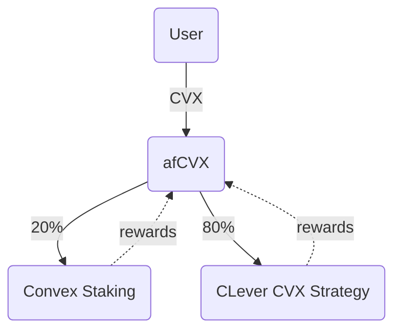
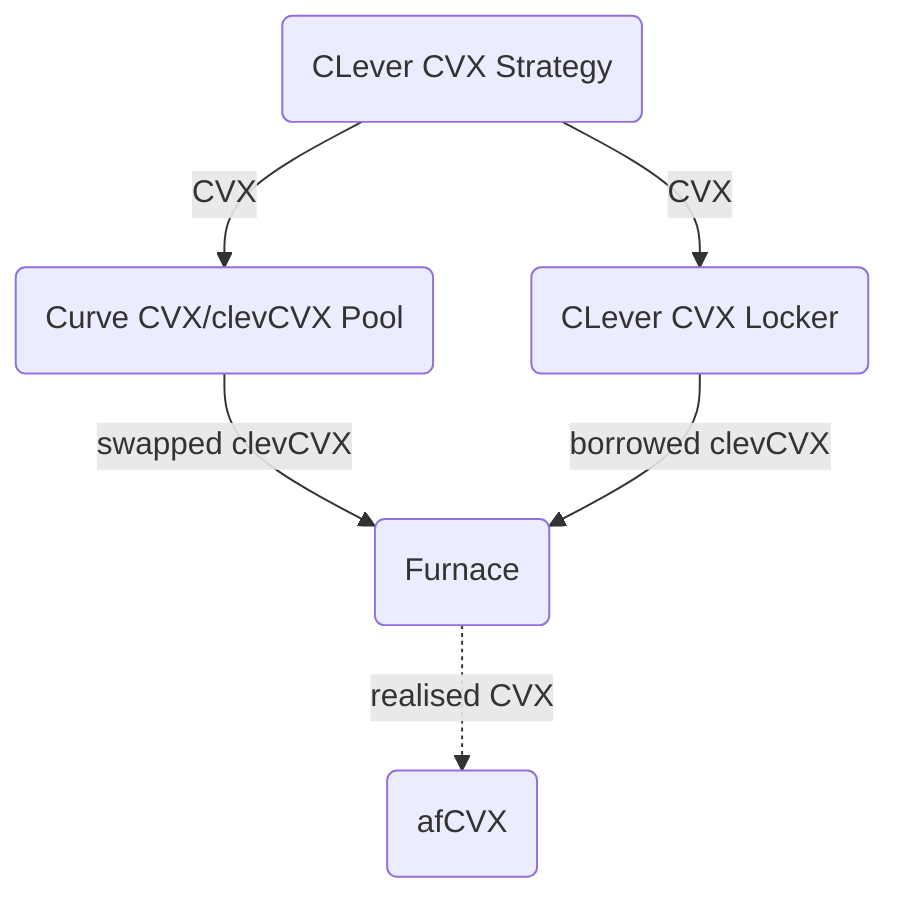

<h1 align="center"> afCVX </h1>


## Overview


AfCvx is an [ERC-4626](https://eips.ethereum.org/EIPS/eip-4626) compliant vault contract that takes CVX deposits mints shares corresponding to the share of the underlying assets held in the vault, and then allocates the asset to [Convex Rewards Pool](https://etherscan.io/address/0xCF50b810E57Ac33B91dCF525C6ddd9881B139332#code), [CLever CVX Locker](https://etherscan.io/address/0x96C68D861aDa016Ed98c30C810879F9df7c64154#code) and [Furnace](https://etherscan.io/address/0xCe4dCc5028588377E279255c0335Effe2d7aB72a#code) contracts to earn yield. Rewards coming from the underlying platforms are compounded back into the protocol.

## How afCVX Works

Users deposit CVX to afCVX and the vault in turn allocates the funds into the two strategies:
- Convex Staking
- CLever CVX 

The target ratio for the strategies is configured to allocate 20% of available funds to Convex Staking and 80% to CLever CVX Strategy. Deposited funds are rebalanced each time the vault operator distributes the assets to maintain the ratio.



## Convex Staking Strategy

The Convex Staking strategy is a simple strategy that deposits CVX to [Convex Rewards Pool](https://etherscan.io/address/0xCF50b810E57Ac33B91dCF525C6ddd9881B139332#code) to earn crvCVX rewards. When the vault operator harvests the rewards they are swapped to CVX to be compounded back to the protocol.

> [!NOTE] 
> Since Convex Staking strategy is very simple, it's implemented directly inside afCvx contract to avoid unnecessary external contract calls.

## CLever CVX Strategy

CLever CVX strategy utilizes CLever CVX and Furnace protocols to maximize the yield. CVX allocated to the strategy can either be swapped for clevCVX and deposited to Furnace or locked in CLever CVX Locker. The latter option allows the vault operator to borrow clevCVX and deposit it to Furnace. The realised CVX from Furnace is compounded back to the protocol.



## Deployed Contracts

|Contract name|Address|
|-----------|--------------|
|AfCvx Proxy| [`0x8668a15b7b023Dc77B372a740FCb8939E15257Cf`](https://etherscan.io/address/0x8668a15b7b023Dc77B372a740FCb8939E15257Cf)|
|AfCvx Implementation|[`0x87e670b71958d39113b7961dd016ec198ad82c03`](https://etherscan.io/address/0x87e670b71958d39113b7961dd016ec198ad82c03)|
|CleverCvxStrategy Proxy|[`0xB828a33aF42ab2e8908DfA8C2470850db7e4Fd2a`](https://etherscan.io/address/0xB828a33aF42ab2e8908DfA8C2470850db7e4Fd2a)|
|CleverCvxStrategy Implementation|[`0x98f3f4ba1bbcd4fa3d7caf1eb88d93cd628cff02`](https://etherscan.io/address/0x98f3f4ba1bbcd4fa3d7caf1eb88d93cd628cff02)|


## Audits

- [yAudit](https://reports.yaudit.dev/reports/04-2025-asymmetry-afCFV/)
- [adrianromero](https://github.com/romeroadrian/audits/tree/main/solo/2024-05-afcvx)

## Development

The repository is build with Foundry.
To build the project use 

```
forge build
```

afCVX tests rely on an RPC connection for forking network state. Make sure you have an .env file in the root directory with the following key and value:

```
ETHEREUM_RPC_URL=[Your Ethereum Mainnet RPC URL]
```

To run test use 

```
forge tets
```

To format Solidity files use

```
forge fmt
```
